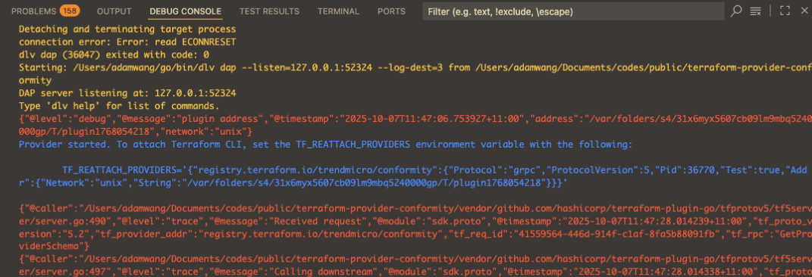

# Conformity Terraform Provider

## How to set up local machine:

#### 1. Navigate to project directory:
```sh
cd /path/terraform-provider-conformity
```
#### 2. Install dependencies:
```sh
go mod tidy
go mod vendor
```
#### 3. Update Makefile with your own values:
```makefile
# ...
VERSION=0.6 # Set a new version
OS_ARCH=darwin_amd64 # Update to value that matches with your OS
# ...
```
#### 4. Create the Artifact:
```sh
make install
```
#### 5. Go to your terraform project, and update `source` set in your terraform provider block:
```hcl
terraform {
  required_providers {
    conformity = {
      version = "YOUR_VERSION"

      # Set path to match with values in HOSTNAME/NAMESPACE/NAME defined in the Makefile
      source  = "trendmicro.com/cloudone/conformity" 
    }
  }
}
```
#### 6. Now, you can test terraform code:
```sh
cd example/path-to-main/
terraform init
terraform apply
```
Notes:<br> 
* for your own config, create a file name `terraform.tfvars`
* add the following:
```sh
region  = "region"
apikey  = "apikey"
```


 Turn on debug:
```sh
export TF_LOG_CORE=TRACE
export TF_LOG_PROVIDER=TRACE
```

* when you are testing, you can set environment variable `CONFORMITY_API_URL` to match your testing API url; otherwise it will use default official API url.

#### Debugging in vscode
1. Make sure you installed the "Go for Visual Studio Code" extension which will install the golang debug tool `dlv` for you
2. Make sure you created the correct section in `.vscodelaunch.json`
```json
{
  "name": "Debug - Attach External CLI",
  "type": "go",
  "request": "launch",
  "mode": "debug",
  // this assumes your workspace is the root of the repo
  "program": "${workspaceFolder}",
  "internalConsoleOptions": "openOnSessionStart",
  "env": {},
  "args": [
      // pass the debug flag for reattaching
      "-debug",
  ],
}
```
3. Before you start debugging you need update some files:
  - Update the getUrl function in pkg/cloudconformity/client.go to make it return the API endpoint you want to test with
  for example:
  ```go
  return "https://ap-southeast-2-development.cloudconformity.com/api/", nil
  ``` 
  - Make sure your test template uses provider config
  ```terraform
  terraform {
    required_providers {
      conformity = {
        source = "trendmicro/conformity"
        ...
      }
    }
  }
  ```  
4. Start debugging in vscode
  - Look at the vscode "DEBUG CONSOLE", the dlv will output the TF_REATTACH_PROVIDERS environment variable
  
  The format looks like 
  ```
  TF_REATTACH_PROVIDERS='{"registry.terraform.io/trendmicro/conformity":{"Protocol":"grpc","ProtocolVersion":5,"Pid":36770,"Test":true,"Addr":{"Network":"unix","String":"/var/folders/s4/31x6myx5607cb09lm9mbq5240000gp/T/plugin1768054218"}}}'
  ```
  You must `export` it in the terminal which you will test with
  - Remember! Each time when you restart debugging the `TF_REATTACH_PROVIDERS` value will refresh, and you need export it again

5. Set the breakpoints and run `terrafrom` commands in the terminal


## How to protect API keys

#### 1. with file

Create a file name `terraform.tfvars` and add all necessary variables here

Ensure `terraform.tfvars` is included in `.gitignore` so these secrets are not accidentally pushed to a remote git repository.

#### 2. with environment variables

Terraform provides a way of reading variables from the environment: https://www.terraform.io/docs/cli/config/environment-variables.html#tf_var_name


## Updating documentation
Use the [Doc Preview Tool](https://registry.terraform.io/tools/doc-preview) to understand how the markdown will look once released. The [Provider Documentation](https://developer.hashicorp.com/terraform/registry/providers/docs) can also provide further guidance.

## How to release
### Steps
#### 1. Go to terraform provider GitHub: https://github.com/trendmicro/terraform-provider-conformity/releases

#### 2. Click "Draft a new release" button

#### 3. Click "Choose a Tag" dropdown, provide tag with value “xxx”, then select "+ Create new Tag : xxx on publish" popup item below.

#### 4. Choose the main branch as "Target"

#### 5. Fill the release title “xxx”

#### 6. Add the released changes to the description. *Do avoid Jira Ticket's IDs as those are not publicly visible.*

#### 7. Click "Publish release" button at the bottom.

### Check the release
After releasing, a webhook will be sent to Terraform registry automatically.
Within about 10 minutes https://registry.terraform.io/providers/trendmicro/conformity/latest/docs  should be updated with the new release from Github.