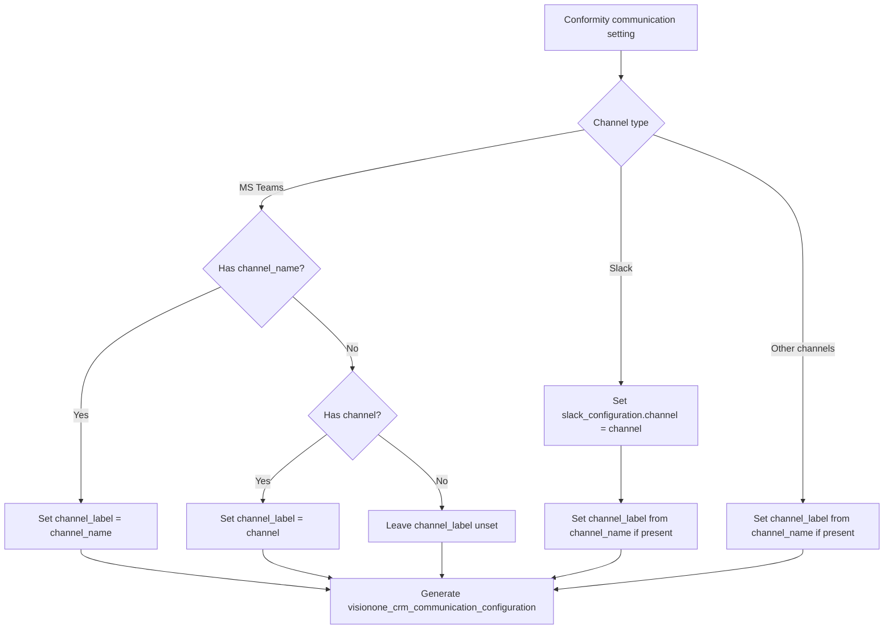

## What It Does

This tool reads your existing Terraform state file and generates:
1. **HCL Resource Definitions**: Vision One provider resource configurations (`visionone_crm_*`) based on your existing Conformity resources
2. **Import Commands**: `terraform import` statements to link the new resource definitions to your existing cloud resources
3. **Mapping Documentation**: Showing which Conformity attributes were mapped to Vision One attributes

## Supported Resources

- `conformity_communication_setting` → `visionone_crm_communication_configuration`
- `conformity_profile` → `visionone_crm_profile`
- `conformity_group` → `visionone_crm_group`
- `conformity_report_config` → `visionone_crm_report_configuration`
- `conformity_custom_rule` → `visionone_crm_custom_check`
- `conformity_apply_profile` (data source) → `visionone_crm_apply_profile` (data source)

## Common Scenarios

### ServiceNow Communication Settings

The tool automatically maps:
- `creation_override` → `dictionary_overrides[creation]`
- `resolution_override` → `dictionary_overrides[resolution]`
- Legacy `close_code` + `close_notes` → `dictionary_overrides[resolution]`

**Precedence**: Explicit `resolution_override` takes priority over legacy fields.

### Resource Names

The tool preserves your original Terraform resource names:
- `conformity_communication_setting.my_email` → `visionone_crm_communication_configuration.my_email`

This ensures your resource references (e.g., `conformity_communication_setting.my_email.id`) can be easily updated to `visionone_crm_communication_configuration.my_email.id`.

## Notes

- Profile scan rules are migrated from Conformity `included` rules with these mappings:
  - `exceptions.tags` and `exceptions.filter_tags` are merged into `filter_tags`.
  - `exceptions.resources` maps to `resource_ids`.
  - Extra settings are converted to `value`, `value_set`, or `values` based on type
  - `settings` blocks named `tags-override` are mapped to `customized_tags` and the extra setting type is upgraded to `choice-multiple-value-with-tags`.
  - Other nested Conformity `settings` are not migrated because those nested settings blocks don’t have a clear equivalent in the Vision One extra_settings.values schema. Vision One’s model for extra_settings.values supports fields like value, enabled, customized_tags, and customized_risk_level, but it doesn’t represent arbitrary nested settings (like your settings array under values with its own name/type/values). Without a safe, documented mapping, the tool would either drop data or create invalid payloads.
  We can define a custom mapping for those nested settings (for example, flattening them into JSON and sending as value for multiple-object-values types), but we’d need to confirm the API accepts that format for each rule type.
- Report config mappings:
  - Conformity `configuration.title` maps to `report_title` and `generate_report_type` maps to `report_type`.
  - `scheduled`, `frequency`, and `tz` map to `schedule.frequency` and `schedule.timezone` when scheduled is true.
  - `emails` maps to `email_recipients` only when `send_email` is true; `should_email_include_pdf/csv` map to `report_formats_in_email`.
  - Filter fields map to `checks_filter` (e.g., categories, risk_levels, providers, resource_types, rule_ids).
  - `filter_tags` and `tags` are merged into `checks_filter.tags`.
  - `text` maps to `checks_filter.description` and `resource` maps to `checks_filter.resource_id`.
  - For compliance reports, `report_compliance_standard_id` maps to `applied_compliance_standard_id`, and `with_checks/without_checks` map to `controls_type`.
- Custom rule mappings:
  - `name`, `description`, `cloud_provider`, `service`, `resource_type`, `enabled`, and `categories` map directly.
  - `severity` maps to `risk_level`.
  - `remediation_notes` maps to `remediation_note`.
  - `attributes` map to `attribute` blocks.
  - `rules` map to `event_rule` blocks using `event_type` for description and `operation` for conditions operator.
  - `conditions.value` is formatted to preserve booleans, numbers, nulls, and JSON objects when possible.
- Communication settings mappings:
  - `enabled`, `manual` map directly.
  - `relationships.account.id` maps to `account_id`.
  - `filter` maps to `checks_filter` (merge `filter_tags` + `tags` into `tags`).
  - `compliances` maps to `compliance_standard_ids`.
  - `email.users` -> `email_configuration.user_ids` (requires `{identifierId}#{companyId}` format).
  - `sms.users` -> `sms_configuration.user_ids` (requires `{identifierId}#{companyId}` format).
  - `ms_teams` -> `ms_teams_configuration` (URL + include flags).
  - `slack` -> `slack_configuration` (URL + channel + include flags).
  - `sns` -> `sns_configuration` (arn).
  - `pager_duty` -> `pagerduty_configuration` (service_name, service_key).
  - `webhook` -> `webhook_configuration` (url, security_token; headers must be added manually).
  - `service_now` -> `servicenow_configuration` (type, url, username, password, assignee, impact, urgency).
  - `service_now.creation_override` and `service_now.resolution_override` map to `servicenow_configuration.dictionary_overrides` with triggers `creation` and `resolution`.
  - `service_now.close_code` / `service_now.close_notes` (including camelCase variants) map into the `resolution` entry under `servicenow_configuration.dictionary_overrides`.
  - When both `service_now.close_code` / `service_now.close_notes` and `service_now.resolution_override` define the same keys, values in `resolution_override` take precedence.
- Apply profile mappings:
  - `profile_id`, `account_ids`, `mode`, and `notes` map directly.
  - `include.exceptions` maps to `include.exceptions` when present.
  - The migration emits a `data "visionone_crm_apply_profile"` block and does not add import commands.

## MS Teams Mapping Notes:

- `channel_name` in `conformity_communication_setting.ms_teams` maps to `channel_label` in `visionone_crm_communication_configuration`.
- `channel` in old non-V1 MS Teams settings is not used for notification delivery; it is only label-like metadata.
- For migration safety, if only one of `channel` or `channel_name` exists, map that value to `channel_label`.
- If both exist for MS Teams, choose one consistent value for `channel_label` (prefer `channel_name` if present).
- For non-MS Teams channels, map `channel_name` to `channel_label`.
- For Slack specifically, `channel` remains required and is still mapped to `slack_configuration.channel`.

